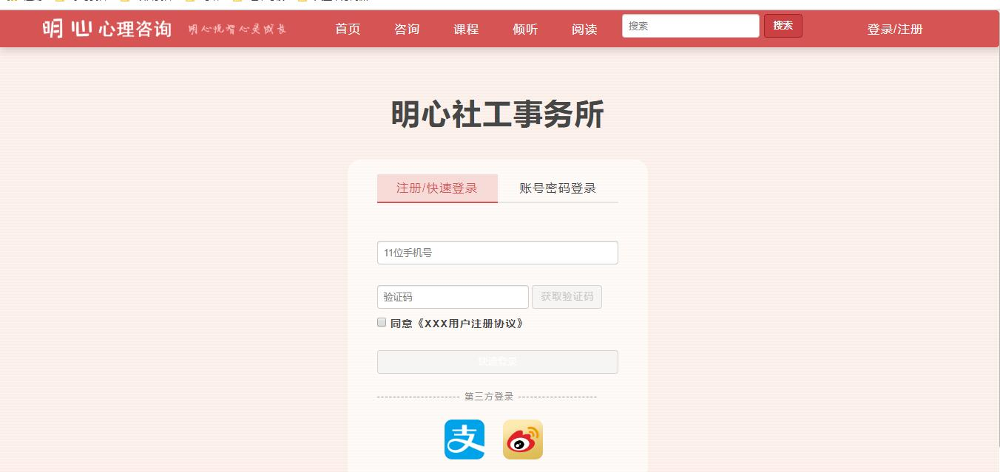
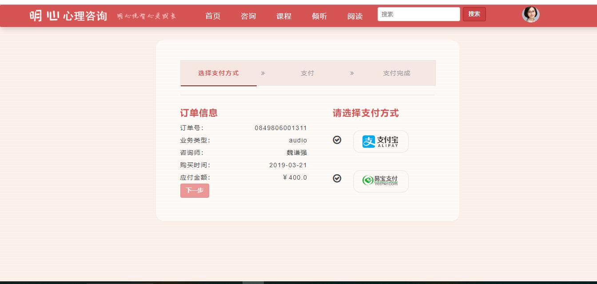
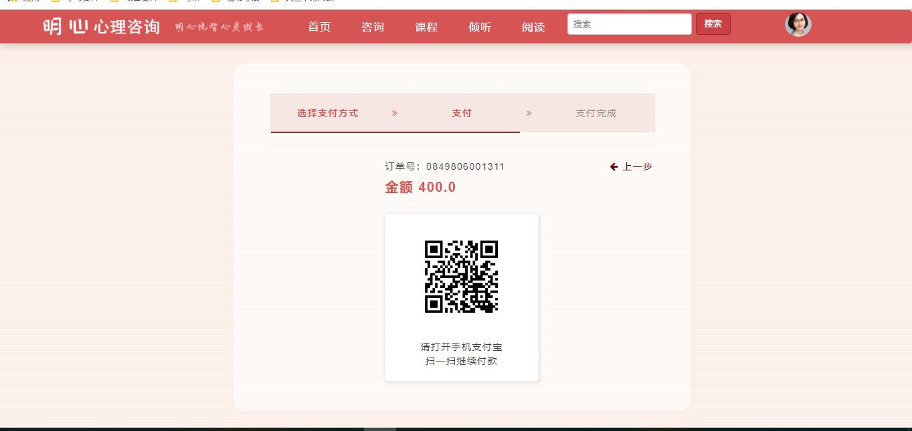
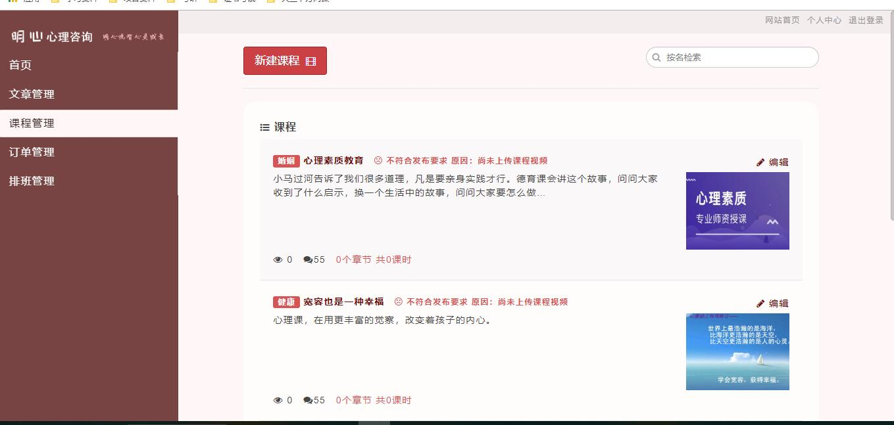
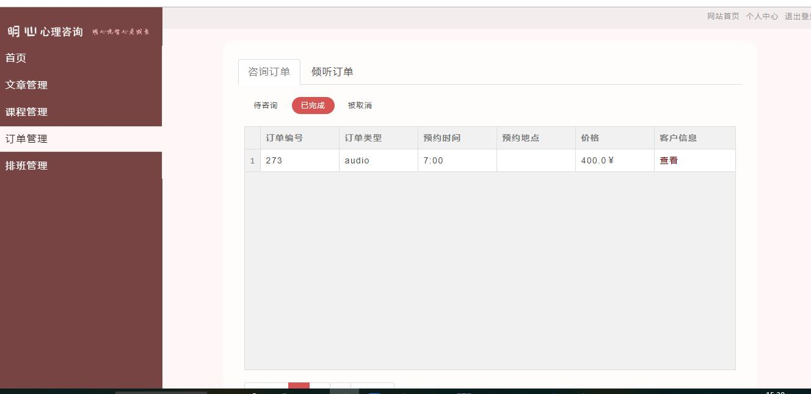



# 2016级项目实训成果展示

## 明心心理咨询——大数据方向

### 项目简介

本项目为明心社工事务所的企业网站，客户为北京通州明心社工事务所。主要功能为提供网上在线预约业务、网上在线咨询业务，以简化事务所客户的预约流程，提高事务所的工作效率、更好地拓展业务。
另外，项目网站还提供一些附加功能：在线倾听、在线课程、心理文章等；同时融入大数据方面的知识，进行相关的推荐和预测。

### 项目地址
GitHub:[https://github.com/smilingzhang/psychological-counseling]

### 项目成员
- 张春辉 (项目经理、开发工程师、质量专家)
  - GitHub:[https://github.com/smilingzhang]
- 邓旸（开发工程师、UI设计师、质量专家）
  - GitHub:[https://github.com/mutsuo]
- 鲍张军 （开发工程师、需求专家）
  - GitHub:[https://github.com/bao9777]
- 段智兴 (开发工程师、需求专家、数据库设计人员)
  - GitHub:[https://github.com/duanzhix]
- 刘田会 （开发工程师、需求专家）
  - GitHub:[https://github.com/huihuiyouyou]
- 魏谦强 （开发工程师、需求专家）
  - GitHub:[https://github.com/WeiQianQiang]
- 孙明伟 （开发工程师、需求专家）
  - GitHub:[https://github.com/sunmingwei]
- 刘海迪 （测试工程师）
  - GitHub:[https://github.com/liuhaidi]

###项目截图

